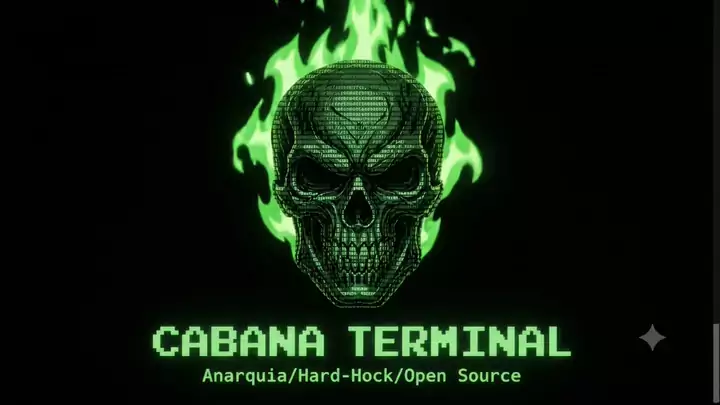

<div align="center">



```console
root@cabana:~# whoami
CabanaTerminal — comunidade open source brasileira
root@cabana:~# uname -a
Aprendizado de linguagens + CTFs + barulho de guitarra
root@cabana:~# ./iniciar.sh --modo=hardcore
[ OK ] Rebeldia carregada. Bem-vindo à Cabana.
```

[](LICENSE)
[](https://github.com/CabanaTerminal)
[](https://github.com/CabanaTerminal)
[](https://github.com/CabanaTerminal)

</div>

```text
                                    ██████╗ █████╗ ██████╗  █████╗ ███╗   ██╗ █████╗
                                   ██╔════╝██╔══██╗██╔══██╗██╔══██╗████╗  ██║██╔══██╗
                                   ██║     ███████║██████╔╝███████║██╔██╗ ██║███████║
                                   ██║     ██╔══██║██╔══██╗██╔══██║██║╚██╗██║██╔══██║
                                   ╚██████╗██║  ██║██████╔╝██║  ██║██║ ╚████║██║  ██║
                                    ╚═════╝╚═╝  ╚═╝╚═════╝ ╚═╝  ╚═╝╚═╝  ╚═══╝╚═╝  ╚═╝
                                   ████████╗███████╗██████╗ ███╗   ███╗██╗███╗   ██╗ █████╗ ██╗
                                   ╚══██╔══╝██╔════╝██╔══██╗████╗ ████║██║████╗  ██║██╔══██╗██║
                                      ██║   █████╗  ██████╔╝██╔████╔██║██║██╔██╗ ██║███████║██║
                                      ██║   ██╔══╝  ██╔══██╗██║╚██╔╝██║██║██║╚██╗██║██╔══██║██║
                                      ██║   ███████╗██║  ██║██║ ╚═╝ ██║██║██║ ╚████║██║  ██║███████╗
                                      ╚═╝   ╚══════╝╚═╝  ╚═╝╚═╝     ╚═╝╚═╝╚═╝  ╚═══╝╚═╝  ╚═╝╚══════╝
                                 
                                               ▄▄▄▄▄▄▄▄▄▄▄▄▄▄▄▄▄▄▄▄▄▄▄▄▄▄▄▄▄▄▄▄▄▄▄
                                              ██ ▄▄▄▄▄▄▄▄▄▄▄▄▄▄▄▄▄▄▄▄▄▄▄▄▄▄▄▄▄▄▄▄▄ ██
                                              ██ █  ▀▀▀▀  ▀▀▀▀  ▀▀▀▀  ▀▀▀▀  ▀▀▀▀  █ ██
                                              ██ █ ▄▄▄▄ ███ ▄▄▄▄ ███ ▄▄▄▄ ███ ▄▄▄▄ █ ██
                                              ██ █ ▀▀▀▀ ▀▀▀ ▀▀▀▀ ▀▀▀ ▀▀▀▀ ▀▀▀ ▀▀▀▀ █ ██
                                              ██ █▄▄▄▄▄▄▄▄▄▄▄▄▄▄▄▄▄▄▄▄▄▄▄▄▄▄▄▄▄▄▄▄▄█ ██
                                              ██▄▄▄▄▄▄▄▄▄▄▄▄▄▄▄▄▄▄▄▄▄▄▄▄▄▄▄▄▄▄▄▄▄▄▄▄▄▄██
                                               ▀▀▀▀▀▀▀▀▀▀▀▀▀▀▀▀▀▀▀▀▀▀▀▀▀▀▀▀▀▀▀▀▀▀▀▀▀
```

---

## `> cat sobre.md`

A **CabanaTerminal** é uma comunidade **open source brasileira** feita pra quem
aprende na porrada, na base do `man`, do erro de compilação e da madrugada.

Aqui a gente estuda **linguagens de programação** em conjunto, resolve
**CTFs** (Capture The Flag) pra treinar segurança ofensiva/defensiva e mantém
tudo aberto: código, anotações, write-ups e ferramentas.

> **Sem chefe. Sem dono. Sem patrão. Só commit.**

O espírito é **hard rock**: volume alto, atitude, zero frescura e muito
`git push --force` na branch da preguiça (brincadeira, nunca faça isso).

```console
root@cabana:~# philosophy --list
[+] Aprender em público      -> conhecimento que não circula apodrece
[+] Cooperar > competir      -> ninguém evolui sozinho
[+] Sem gatekeeping          -> pergunta boba não existe
[+] Código aberto sempre     -> fork é liberdade
[+] Hackear é estudar        -> entender como as coisas quebram
```

---

## `> ls -la /objetivos`

```text
drwxr-xr-x  aprendizado-de-linguagens/
drwxr-xr-x  ctfs-e-writeups/
drwxr-xr-x  ferramentas-e-scripts/
drwxr-xr-x  desafios-da-comunidade/
drwxr-xr-x  zines-e-anotacoes/
-rw-r--r--  MANIFESTO.md
-rw-r--r--  CONTRIBUTING.md
-rw-r--r--  CODE_OF_CONDUCT.md
```

| Frente | O que rola |
| :--- | :--- |
| **Linguagens** | Trilhas de C, Python, Go, Rust, JS/TS, Shell e o que a galera quiser puxar |
| **CTF** | Web, pwn, crypto, reversing, forensics, OSINT, misc |
| **Ferramentas** | Scripts, automações e utilitários feitos pela própria comunidade |
| **Write-ups** | Todo desafio resolvido vira documentação pública |
| **Mutirão** | Sessões de pair programming e resolução de problemas ao vivo |

---

## `> ./participar --help`

```console
USO:
  cabana participar [--modo=colaborador|estudante|ctf-player]

PASSOS:
  1. Dê um fork no repositório
  2. Crie uma branch:  git checkout -b feat/minha-contribuicao
  3. Commit com atitude: git commit -m "feat: mais uma cabeça pensante"
  4. Abra um Pull Request e chame a galera

REGRAS:
  [x] Respeito sempre. Toxicidade = ban sem apelação.
  [x] Dúvida não é vergonha, é o começo do hack.
  [x] Compartilhe o que aprendeu. Sem ego, sem gatekeeping.
  [x] Créditos pra quem fez. Colaboração não é competição.
```

Não tem hierarquia, não tem "senior". Tem gente disposta a aprender e a
ensinar. **Chega chegando, abre uma issue e senta na roda.**

---

## `> stack --favoritas`

<div align="center">


</div>

---

## `> cat MANIFESTO.md`

```console
 1. O conhecimento é um bem comum. Prender ele é crime.
 2. Ninguém é dono da verdade nem da máquina.
 3. Errar é parte do processo. Debugar é resistir.
 4. Código aberto, mente aberta, caixa de som no volume máximo.
 5. A gente aprende junto ou não aprende.
 6. Toda ferramenta é política. Use a sua pra libertar, não pra vigiar.
 7. CTF é esporte, é estudo e é diversão. Jogue limpo.
 8. Nenhum currículo, nenhum diploma e nenhum CNPJ define quem pode aprender.
```

---

<div align="center">

```text
       .-.
      (o o)     "Se ninguém vai te dar a resposta,
      | O \      compila a tua cunpadi."
      |   |\
      '~~~'
   --- CABANA TERMINAL ---
```

**`fork() // aprender() // compartilhar() // repetir()`**

Feito com café, distorção e `#!/bin/bash` no Brasil.

`[root@cabana]# exit` █

</div>
